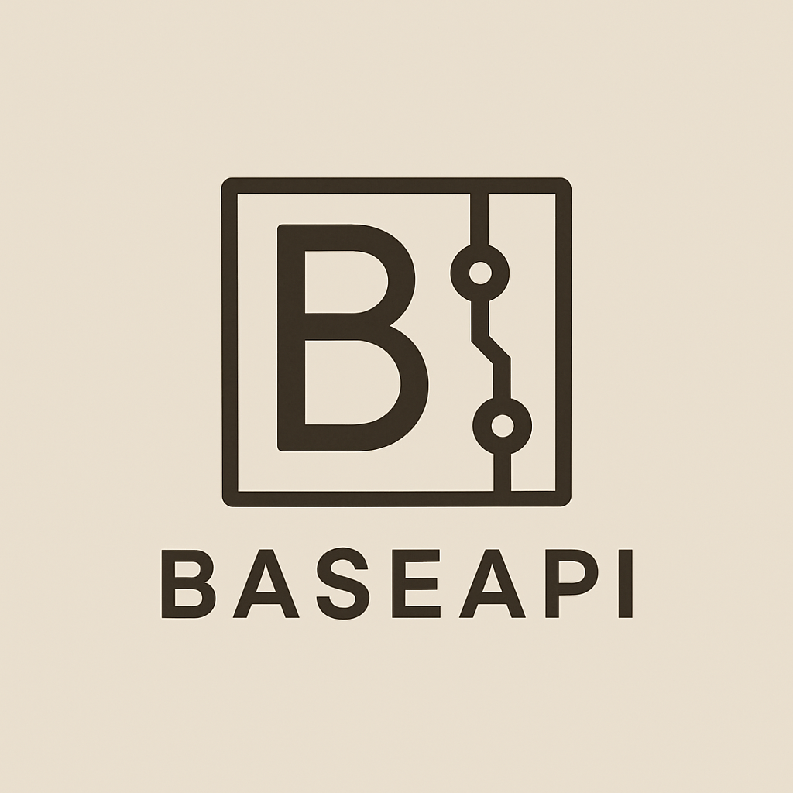

# BaseAPI



A tiny, KISS-first PHP 8.4+ framework for building production-ready REST APIs.

BaseAPI gets out of your way and lets you build APIs in minutes, not hours. Define your models with typed properties, write minimal controllers, and let the framework handle migrations, validation, caching, and documentation automatically.

**[Read the Documentation](https://baseapi.timanthonyalexander.de)**

---

## Quick Start

```bash
composer create-project baseapi/baseapi-template my-api
cd my-api
php mason serve
```

Your API is now running at `http://localhost:7879`.

---

## How Fast Is It to Code?

### Define a Model

Typed properties become your database schema. Migrations are generated automatically.

```php
<?php

namespace App\Models;

use BaseApi\Models\BaseModel;

class Product extends BaseModel
{
    public string $name = '';
    public float $price = 0.0;
    public int $stock = 0;
    public bool $available = true;
    
    public static array $indexes = [
        'name' => 'index',
    ];
}
```

Run `./mason migrate:generate` and `./mason migrate:apply`. Done.

### Write a Controller

```php
<?php

namespace App\Controllers;

use BaseApi\Controllers\Controller;
use BaseApi\Http\JsonResponse;
use App\Models\Product;

class ProductController extends Controller
{
    public string $name = '';
    public float $price = 0.0;
    
    public function get(): JsonResponse
    {
        return JsonResponse::ok(Product::all());
    }
    
    public function post(): JsonResponse
    {
        $this->validate([
            'name' => 'required|string|min:3',
            'price' => 'required|numeric|min:0',
        ]);
        
        $product = new Product();
        $product->name = $this->name;
        $product->price = $this->price;
        $product->save();
        
        return JsonResponse::created($product->jsonSerialize());
    }
}
```

### Add Routes

```php
<?php

use BaseApi\App;
use App\Controllers\ProductController;
use BaseApi\Http\Middleware\RateLimitMiddleware;

$router = App::router();

$router->get('/products', [ProductController::class]);
$router->post('/products', [
    RateLimitMiddleware::class => ['limit' => '10/1m'],
    ProductController::class,
]);
```

That's it. Your API is ready.

---

## Production-Ready from Day One

BaseAPI v1.0.0 is built for production with everything you need:

**Database & Migrations**
- MySQL, PostgreSQL, and SQLite support
- Automatic migration generation from model definitions
- Safe migration mode for production deployments
- Relationship support (belongsTo, hasMany)

**Performance & Caching**
- Sub-millisecond framework overhead
- File and Redis-based caching with tagged invalidation
- Query result caching
- Connection pooling

**Security**
- CORS middleware with configurable allowlists
- Rate limiting with multiple storage backends
- Input validation with 20+ built-in rules
- SQL injection protection via parameterized queries
- Session and API token authentication

**Developer Experience**
- Automatic OpenAPI specification generation
- TypeScript type generation for frontend integration
- Mason CLI for migrations, code generation, and queue management
- Comprehensive validation with custom rules
- Built-in file upload handling with security checks

**Async Processing**
- Queue system with database and sync drivers
- Job retry logic with exponential backoff
- Worker management with memory and time limits

**Internationalization**
- Full i18n support with namespace organization
- Automatic translation via OpenAI or DeepL
- Token scanning and management CLI

**Deployment**
- Environment-based configuration
- Health check endpoints
- Docker-ready
- Supports traditional hosting, VPS, and cloud platforms

---

## Code Quality

BaseAPI maintains high standards with:
- PHPStan level 7 static analysis
- Comprehensive test suite across all database drivers
- Rector for PHP 8.4+ code modernization
- Pre-commit hooks for syntax, tests, and security
- Performance benchmarks: 1,350+ req/s, <1ms overhead, 0.8MB/request

---

## Documentation

Everything you need to know:

**[Full Documentation](https://baseapi.timanthonyalexander.de)**

Topics covered:
- Getting started guide
- Models, migrations, and relationships
- Controllers, routing, and validation
- Caching strategies and configuration
- Queue system and background jobs
- Authentication and authorization
- File storage and uploads
- Internationalization
- Deployment guides
- API reference

---

## Requirements

- PHP 8.4+
- Composer
- MySQL 8.0+, PostgreSQL 13+, or SQLite 3.35+
- Redis 6.0+ (optional, for caching and queues)

---

## Contributing

We welcome contributions! See [CONTRIBUTING.md](CONTRIBUTING.md) for guidelines.

---

## License

BaseAPI is open-source software licensed under the [MIT license](LICENSE).

---

## Links

- **[Documentation](https://baseapi.timanthonyalexander.de)**
- **[Issue Tracker](https://github.com/timanthonyalexander/base-api/issues)**
- **[Template Repository](https://github.com/timanthonyalexander/base-api-template)**
